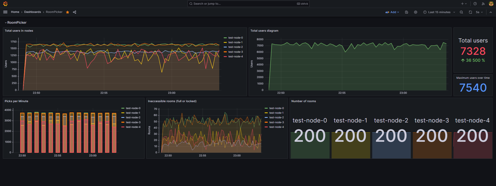

RoomPicker
======

Simple matchmaking system and load balancer. 

Features:
- Simple to use. Everything works out of the box.
- 3 picking methods (Sequential filling, Round Robin, Least picked).
- Optional control panel.
- Collecting metrics using Prometheus integration ([ready Grafana dashboard](./RoomPicker-Grafana-Dashboard.json)).

**This project is under development. Do not use in production!**


How to use
----------

First you need start `RoomPicker Server` and then you can start `RoomPicker Control Panel` (if you need).
After that, you can connect to the server using `RoomPicker Client`.


Example of using the RoomPicker Client
----------

Create a Node and a Room, after that, system pick up a room for 5 users.
```java
class Example {
    public static void main(String[] args) {
        var client = new RoomPickerClient(
                "http://dragonestia.ru:8080",
                "admin",
                "qwerty123"
        );

        // Creating node
        var nodeId = NodeIdentifier.of("test-node");
        var nodeDefinition = new NodeDefinition(nodeId)
                .setPickingMethod(PickingMethod.LEAST_PICKED);
        client.getNodeRepository().saveNode(nodeDefinition);

        // Creating room
        var roomId = RoomIdentifier.of("test-room");
        var roomDefinition = new RoomDefinition(nodeId, roomId)
                .setMaxSlots(10)
                .setPayload("Hello world!");
        client.getRoomRepository().saveRoom(roomDefinition);

        // Picking room for 5 users
        var users = new HashSet<UserIdentifier>();
        for (int i = 0 ; i < 5; i++) {
            var user = UserIdentifier.of("test-user-" + i);
            users.add(user);
        }
        try {
            var response = client.getNodeRepository().pickRoom(nodeId, users);
            // TODO...
        } catch (NoRoomsAvailableException ex) {
            // Cannot pick room
        }
    }
}
```


Stress testing
----------

If you want to stress test the server, you can run the script from the `noiser` module.
Before starting stress testing, you'd better run Prometheus and Grafana from `docker-compose.yml`.
In Grafana, you can see this view:
